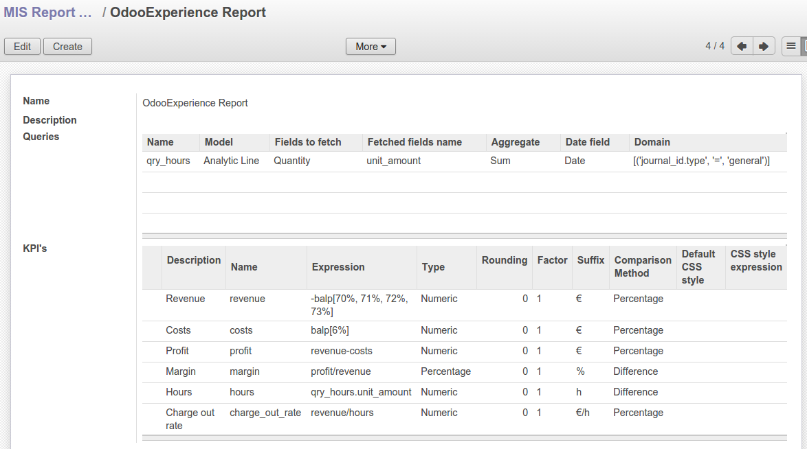
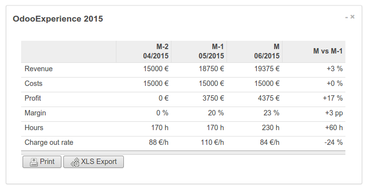

.. image:: https://img.shields.io/badge/licence-AGPL--3-blue.svg
    :target: http://www.gnu.org/licenses/agpl-3.0-standalone.html
    :alt: License: AGPL-3

===========
MIS Builder
===========

This module allows you to build Management Information Systems dashboards.
Such style of reports presents KPI in rows and time periods in columns.
Reports mainly fetch data from account moves, but can also combine data coming
from arbitrary Odoo models. Reports can be exported to PDF, Excel and they
can be added to Odoo dashboards.

Installation
============

There is no specific installation procedure for this module.

Configuration and Usage
=======================

To configure this module, you need to:

* Go to Accounting > Configuration > Financial Reports > MIS Report Templates where
  you can create report templates by defining KPI's. KPI's constitute the rows of your
  reports. Such report templates are time independent.

* Then in Accounting > Reporting > MIS Reports you can create report instance by
  binding the templates to time period, hence defining the columns of your reports.

.. figure:: static/description/ex_report.png
   :alt: Sample report configuration

* From the MIS Report view, you can preview the report, add it to and Odoo dashboard,
  and export it to PDF or Excel.

.. image:: https://odoo-community.org/website/image/ir.attachment/5784_f2813bd/datas
   :alt: Try me on Runbot
   :target: https://runbot.odoo-community.org/runbot/91/8.0

For further information, please visit:

* https://www.odoo.com/forum/help-1

Developer notes
===============

A typical extension is to provide a mechanism to filter reports on analytic dimensions
or operational units. To implement this, you can override _get_additional_move_line_filter
and _get_additional_filter to further filter move lines or queries based on a user
selection. A typical use case could be to add an analytic account field on mis.report.instance,
or even on mis.report.instance.period if you want different columns to show different
analytic accounts.

Known issues / Roadmap
======================

* V9 thoughts:

  * select accounts by tag (see also select accounts by type below)
  * how to handle multi-company consolidation now that consolidation children are gone?
  * what replaces root accounts / account charts in v9? nothing it seems, so
    we are limited to one chart of accounts per company;
  * for multi-company consolidation, must we replace the consolidation chart
    of account by a list of companies?

* Allow selecting accounts by type. This is currently possible by expressing
  a query such as balp[][('account_id.user_type.code', '=', ...)]. This will work
  but would be more efficient if one could write balp[user_type=...], as it would
  involve much less queries to the database.
  Possible syntax could be balp[code:60%,70%], balp[type:...], balp[tag:...],
  with code: being optional and the default.

* More tests should be added. The first part is creating test data, then it will be
  easier. At the minimum, We need the following test data:

  * one account charts with a few normal accounts and view accounts,
  * two fiscal years,
  * an opening entry in the second fiscal year,
  * to test multi-company consolidation, we need a second company with it's own
    account chart and two fiscal years, but without opening entry; we also need
    a third company which is the parent of the other two and has a consolidation
    chart of account.

Bug Tracker
===========

Bugs are tracked on `GitHub Issues <https://github.com/OCA/account-financial-reporting/issues>`_.
In case of trouble, please check there if your issue has already been reported.
If you spotted it first, help us smashing it by providing a detailed and welcomed feedback
`here <https://github.com/OCA/account-financial-reporting/issues/new?body=module:%20mis_builder%0Aversion:%208.0%0A%0A**Steps%20to%20reproduce**%0A-%20...%0A%0A**Current%20behavior**%0A%0A**Expected%20behavior**>`_.

Credits
=======

Contributors
------------

* Stéphane Bidoul <stephane.bidoul@acsone.eu>
* Laetitia Gangloff <laetitia.gangloff@acsone.eu>
* Adrien Peiffer <adrien.peiffer@acsone.eu>
* Alexis de Lattre <alexis.delattre@akretion.com>
* Alexandre Fayolle <alexandre.fayolle@camptocamp.com>
* Jordi Ballester <jordi.ballester@eficent.com>
* Thomas Binsfeld <thomas.binsfeld@gmail.com>
* Giovanni Capalbo <giovanni@therp.nl>
* Marco Calcagni <mcalcagni@dinamicheaziendali.it>
* Sébastien Beau <sebastien.beau@akretion.com>
* Laurent Mignon <laurent.mignon@acsone.eu>

Maintainer
----------

.. image:: https://odoo-community.org/logo.png
   :alt: Odoo Community Association
   :target: https://odoo-community.org

This module is maintained by the OCA.

OCA, or the Odoo Community Association, is a nonprofit organization whose
mission is to support the collaborative development of Odoo features and
promote its widespread use.

To contribute to this module, please visit http://odoo-community.org.
