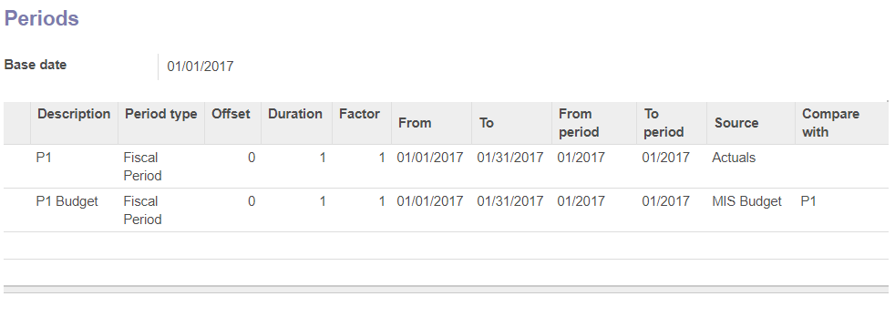

.. image:: https://img.shields.io/badge/licence-AGPL--3-blue.svg
   :target: http://www.gnu.org/licenses/agpl-3.0-standalone.html
   :alt: License: AGPL-3

==================
Mis Builder Budget
==================

Create budgets for MIS reports

Installation
============

There is no specific installation procedure for this module.

Configuration
=============

To configure this module, you need to:

* Go to Accounting > Configuration > Financial Reports > MIS Report Templates where
  you can enable KPI's for use in Budgets.

* Go to Accounting > Reporting > MIS Budgets to define your budgets.

* Then in Accounting > Reporting > MIS Reports you can create report instances by
  binding the templates to time periods, hence defining the columns of your reports.
  Select 'MIS Budget' and 'Actuals' as data sources in order to Compare
  actual Business Performance with Budget.

.. image:: https://odoo-community.org/website/image/ir.attachment/5784_f2813bd/datas
   :alt: Try me on Runbot
   :target: https://runbot.odoo-community.org/runbot/91/8.0

Known issues / Roadmap
======================

* The current version of this module assumes equal start/stop dates of
  budget and report periods.

Bugs are tracked on `GitHub Issues <https://github.com/OCA/account-financial-reporting/issues>`_.
In case of trouble, please check there if your issue has already been reported.
If you spotted it first, help us smashing it by providing a detailed and welcomed feedback
`here <https://github.com/OCA/account-financial-reporting/issues/new?body=module:%20mis_builder%0Aversion:%208.0%0A%0A**Steps%20to%20reproduce**%0A-%20...%0A%0A**Current%20behavior**%0A%0A**Expected%20behavior**>`_.

Credits
=======

Contributors
------------

* Stéphane Bidoul <stephane.bidoul@acsone.eu>
* Luc De Meyer <luc.demeyer@noviat.com>

Maintainer
----------

.. image:: https://odoo-community.org/logo.png
   :alt: Odoo Community Association
   :target: https://odoo-community.org

This module is maintained by the OCA.

OCA, or the Odoo Community Association, is a nonprofit organization whose
mission is to support the collaborative development of Odoo features and
promote its widespread use.

To contribute to this module, please visit https://odoo-community.org.
